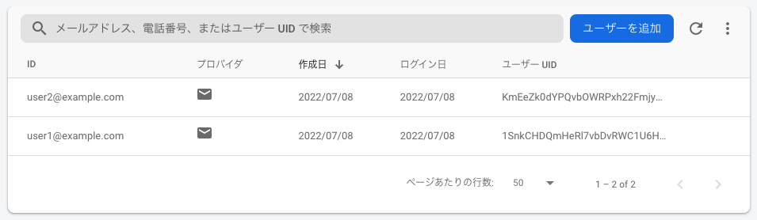

# 動作確認

### 1. DB のセットアップ

```shell
rails db:migrate
rails db:seed
```

```shell
# それぞれuser1 と post1、user2 と post2が紐付いていることを確認
rails c
❯ User.all
=> ︙
❯ Post.all
=> ︙
```

### 2. 既に作成済みのユーザーの idToken を取得

firebase にはこれらのユーザーが作成済み。

この中の user1@example.com の idToken を取得する。

```shell
export API_KEY=[API_KEY] # API_KEYは教えるので聞いて下さい
curl "https://identitytoolkit.googleapis.com/v1/accounts:signInWithPassword?key=$API_KEY" -H 'Content-Type: application/json' --data-binary '{"email":"user1@example.com","password":"password","returnSecureToken":true}' | jq .idToken
```

取得した idToken (コマンドの実行結果) をコピーする。

※ jq コマンドが入ってなかったらインストール or 返ってきた JSON の idToken の部分だけコピー

### 3. 認証が機能しているかの確認

**自分に紐づく Post のみ**更新・削除出来るような実装にしている。([実装](./app/controllers/users_controller.rb))

今回は、user1 の idToken を付加している為、post1 のみが削除可能なはずである。これを検証する。

```shell
export ID_TOKEN=[2でコピーしたidToken]
# こっちは成功
curl http://localhost:3000/posts/1 -X DELETE -H 'Content-Type: application/json' -H "Authorization: Bearer ${ID_TOKEN}"

# こっちは失敗
curl http://localhost:3000/posts/2 -X DELETE -H 'Content-Type: application/json' -H "Authorization: Bearer ${ID_TOKEN}"
{"status":404,"error":"Not Found", ... }
```

---

# TODO

- [] ユーザー登録
  - firebase functions.auth.user().onCreate で同期させる or
  - User.find_by(firebase_uid: \*\*) が既に存在していれば login、存在しなければ signup
